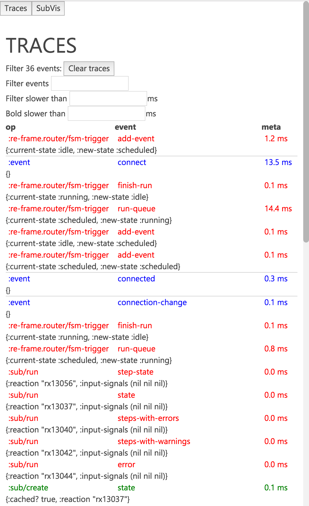

# re-frame-trace

A trace panel for re-frame.

[](https://clojars.org/day8.re-frame/trace)

**Status:** Alpha.

## Motivation

re-frame provides a data driven architecture, but we need to be able to inspect it. re-frame-trace takes inspiration from [redux-devtools](https://github.com/gaearon/redux-devtools), and provides several ways to visualise the structure and state of your re-frame application.



## Installation

If you are using leiningen, modify `project.clj` in the following ways. When puzzling over the various possible leiningen configurations, it's often helpful to look at a sample [project.clj](https://github.com/technomancy/leiningen/blob/stable/sample.project.clj).

[](https://clojars.org/day8.re-frame/trace)

- Add re-frame-trace as a dev dependency by placing `[day8.re-frame/trace "VERSION"]` within `:profiles :dev :dependencies`. For example:

  ```cljs
  :profiles
     {:dev
        {:dependencies [[some-other-package  "0.0.0"]
                        [day8.re-frame/trace "0.1.0"]] }}
  ```

- Locate the `:compiler` map under `:dev` and add:

  - `:closure-defines      {"re_frame.trace.trace_enabled_QMARK_" true}`
  - `:preloads             [day8.re-frame.trace.preload]`

  For example:

  ```cljs
  {:builds
     [{:id           "dev"
       :source-paths ["src" "dev"]
       :compiler     {...
                      :closure-defines      {"re_frame.trace.trace_enabled_QMARK_" true}
                      :preloads             [day8.re-frame.trace.preload]}}]}
  ```

## Usage

- Start up your application.

- Once it is loaded, focus the document window and press `ctrl-h` to slide open the trace panel and enable tracing.

- When the panel is closed, tracing is disabled.

## How does it work?

re-frame has instrumentation to collect traces throughout various important points in the lifecycle of a re-frame app. re-frame-trace is a consumer of these traces, and provides visualisations of the traces. These traces have a well-defined structure, and will eventually be standardised, allowing other developers to create their own tooling to work against the traces. Currently, re-frame's tracing and re-frame-trace are in alpha and are subject to change at any time.

By default, re-frame tracing is compiled out, so it won't impose a performance cost in production. The trade-off here is that you need to explicitly enable it in development.

The [preloads](https://github.com/clojure/clojurescript/wiki/Compiler-Options#preloads) option (`:preloads [day8.re-frame.trace.preload]`) has to be set in order to automatically monkeypatch Reagent to add appropriate lifecycle hooks. Yes this is gross, and yes we will try and make a PR to reagent to add proper hooks, once we know exactly what we need. The preload namespace also injects a div containing the devtools panel into the DOM.

## Development

### Setting up re-frame-trace for development

You need both the re-frame-trace project _and_ a test project to develop it against. For example, you can use the [todo-mvc](https://github.com/Day8/re-frame/tree/master/examples/todomvc) project.

- Clone `re-frame-trace` to your machine:

  ```
  git clone git@github.com:Day8/re-frame-trace.git
  ```

- Go into the root folder of the test project you're using to develop re-frame-trace with.

  ```
  cd /your/project/folder
  ```

- Add re-frame-trace into this test project using the [instructions](#getting-started) above.

- Still in the test project, create a folder called `checkouts`, then enter the folder:

  ```
  mkdir checkouts
  cd checkouts
  ```

- Create a [relative symlink](https://superuser.com/questions/146231/how-do-i-create-a-relative-symbolic-link-in-linux) from your local re-frame-trace project in the checkouts folder. For example:

  ```
  ln -s ../relative/path/to/your/local/re-frame-trace re-frame-trace
  ```

- If you're using figwheel in the test project, you need to add the checkouts folder (`checkouts/re-frame-trace/src`) to `:cljsbuild :source-paths` in the `project.clj` file. If you're having trouble locating the right place to put this, it might help to look to a sample [project.clj](https://github.com/technomancy/leiningen/blob/stable/sample.project.clj) for inspiration. For example:

  ```
  :cljsbuild {:builds {:client {:source-paths ["checkouts/re-frame-trace/src"]}}}
  ```

- Now run your test project however you usually run it, and re-frame-trace should be in there. \o/

- Additionally, if modifying the `.less` CSS files, compile the css by running within the re-frame-trace directory:

  ```
  lein less auto
  ```

  to watch for changes, or one time by running:

  ```
  lein less once
  ```


### Developing CSS

The CSS for the trace panel are defined both inline and within `src/day8/re_frame/less`. To develop the styles, run

```
lein less auto
```

and the .less file will automatically compile to css on file changes. Don't edit the file within `src/day8/re_frame/css` directly, or it will be overwriten. We are using css preprocessing because in order to isolate the panel styles, we are namespacing the panel styles with the id `#--re-frame-trace--`.
