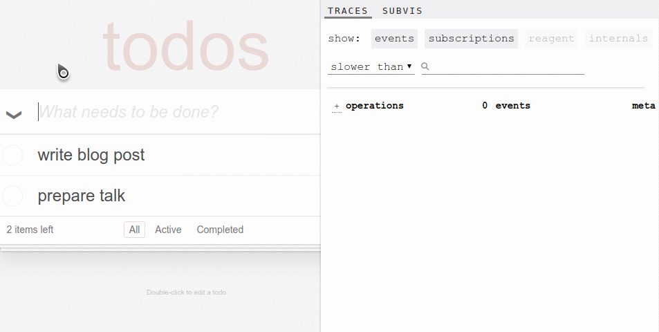

# re-frame-trace

`re-frame-trace` is a programmer's dashboard 
for inspecting, understanding and debugging a running `re-frame` application.

**Status:** Alpha.  [](https://clojars.org/day8.re-frame/trace) [](https://versions.deps.co/Day8/re-frame-trace)

**Note** [the latest version 0.1.13](https://github.com/Day8/re-frame-trace/releases/tag/0.1.13) ALSO requires the latest version of re-frame itself - `v0.10.3-alpha1`.


## Dashboard Overview 

`re-frame` applications have a very regular computational path:  first an event happens,
and then boom, boom, boom go a series of known dominos, in a known order. At the end of
it, a `re-frame` app lapses into a quiescent state waiting for the next event to kick 
off the next iteration of the cycle.

We use the term dashboard for this tool quite deliberately. In the business world, dashboards are used to 
show rolled up and summarised data along useful dimensions. The detailed data in not shown unless 
it interests you and you wish to drill down into it.

As it runs, `re-frame` generates detailed "trace data", but a lot of it will be low level and uninteresting, much of the time. 
So, as a "dashboard", `re-frame-trace` shows useful, "rolled up" information "at a glance", while also allowing you to drill down and explore the detail as necessary. All the data you want should be available, but you shouldn't drown in it. 

Each `re-frame` event and its consequent computation forms a logically discrete "epoch" which can be analysed and inspected independently of other epochs.  As a result, the dashboard design is epoch-oriented.

Not only is the underlying trace "just data", but so is much of the observed re-frame proecess. Much of what `re-frame` does on your behalf is the move data from one domino to another. You write the dominos (functions) and `re-frame` will flow data through them. 

So, yeah, its an epoch-oriented, interactive data dashboard for gaining insights and assisting debugging. actually 

> It is also a work in progress, so this descrption runs well ahead of what is delivered now.  

## More Aspirational goals

Here's the vision for what we'd like `re-frame-trace` to deliver (eventually):
  - Help in learning `re-frame`.  If I'm new to `re-frame`, the dashboard should assist me to understand the 
    dominoes and the data flows involved.
  - Help in learning a new code base. It should help me to explore how an unfamiliar application is wired together. When I click 
    on this button "X", it shows me what event is `dispatch`-ed and in what namespace the associated event handler is registered.  And, 
    "oh look, that's interesting - four subscriptions recalculated". Etc.
  - Debugging assistance. Particularly assistance for writing event handlers which hold most of the application logic. 
  - A method for finding performance problems and/or detecting where there is unnecessary computation.


## Visual Sampler



## Installation

If you are using leiningen, modify `project.clj` in the following ways. When puzzling over the various possible leiningen configurations, it's often helpful to look at a sample [project.clj](https://github.com/technomancy/leiningen/blob/stable/sample.project.clj).

[](https://clojars.org/day8.re-frame/trace)

- Add re-frame-trace as a dev dependency by placing `[day8.re-frame/trace "VERSION"]` within `:profiles :dev :dependencies`. For example:

  ```cljs
  :profiles
     {:dev
        {:dependencies [[some-other-package  "0.0.0"]
                        [day8.re-frame/trace "0.0.0 (see version above)"]] }}
  ```

- Locate the `:compiler` map under `:dev` and add:

  - `:closure-defines      {"re_frame.trace.trace_enabled_QMARK_" true}`
  - `:preloads             [day8.re-frame.trace.preload]`

  For example:

  ```cljs
  {:builds
     [{:id           "dev"
       :source-paths ["src" "dev"]
       :compiler     {...
                      :closure-defines      {"re_frame.trace.trace_enabled_QMARK_" true}
                      :preloads             [day8.re-frame.trace.preload]}}]}
  ```

[cljs-devtools](https://github.com/binaryage/cljs-devtools) is not required to use re-frame-trace, but it is highly recommended.

## Usage

- **Make sure you have followed all of the installation instructions above.**

- Start up your application.

- Once it is loaded, focus the document window and press `ctrl-h` to slide open the trace panel and enable tracing.

- When the panel is closed, tracing is disabled.

## Troubleshooting

* Try a `lein clean`
* Make sure you have followed all the installation steps.

## How does it work?

re-frame is instrumented - all important activity generates trace data. `re-frame-trace` consumes this trace data and renders useful visualisations of the `re-frame` process. Currently, re-frame's tracing capabilities are in alpha and are subject to change at any time. We're testing the utility of the the trace by building an app on top. 

By default, re-frame tracing is "compiled out", so it won't impose a performance cost in production. The trade-off here is that you need to explicitly enable it in development.

The [preloads](https://github.com/clojure/clojurescript/wiki/Compiler-Options#preloads) option (`:preloads [day8.re-frame.trace.preload]`) has to be set in order to automatically monkeypatch Reagent to add appropriate lifecycle hooks. Yes this is gross, and yes we will try and make a PR to reagent to add proper hooks, once we know exactly what we need. The preload namespace also injects a div containing the devtools panel into the DOM.

## Developing/Contributing

If you want to work on re-frame-trace, see [DEVELOPERS.md](DEVELOPERS.md).

## Citations

[open](https://thenounproject.com/search/?q=popout&i=334227) by Bluetip Design from the Noun Project
