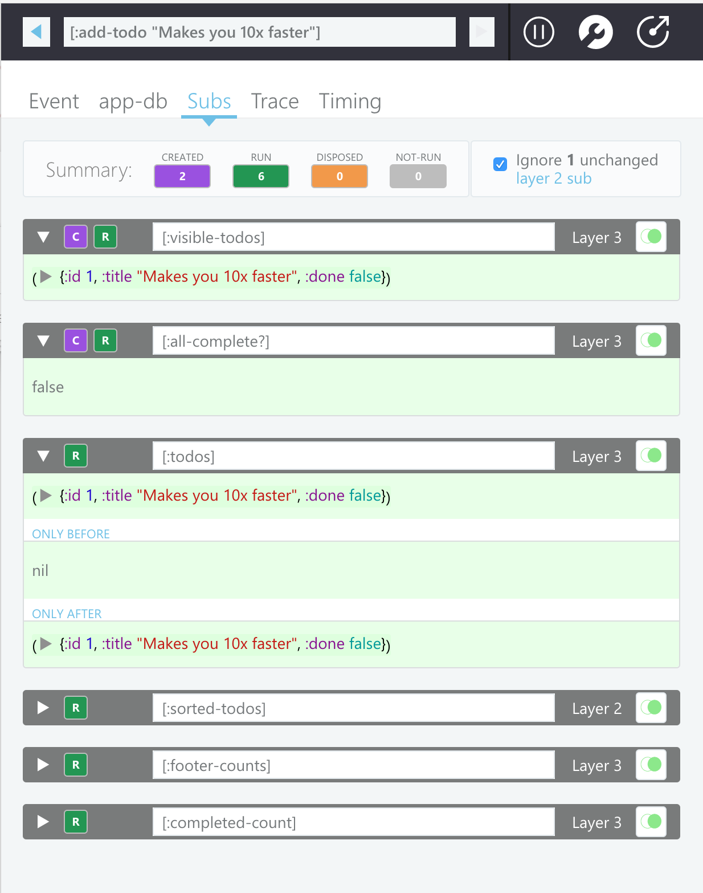
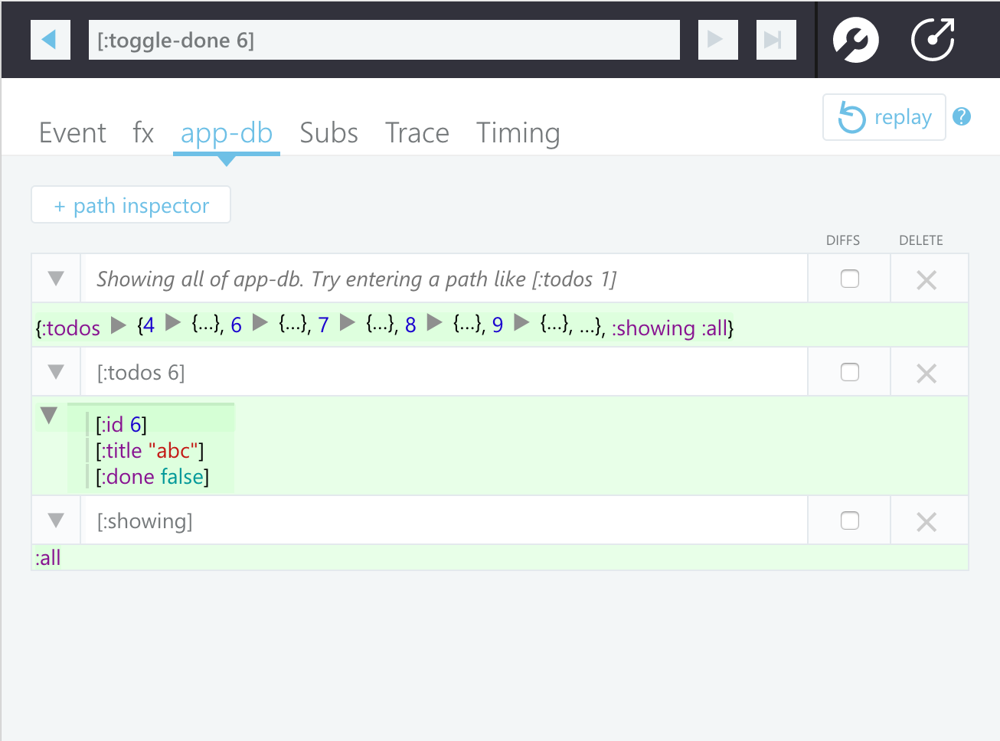
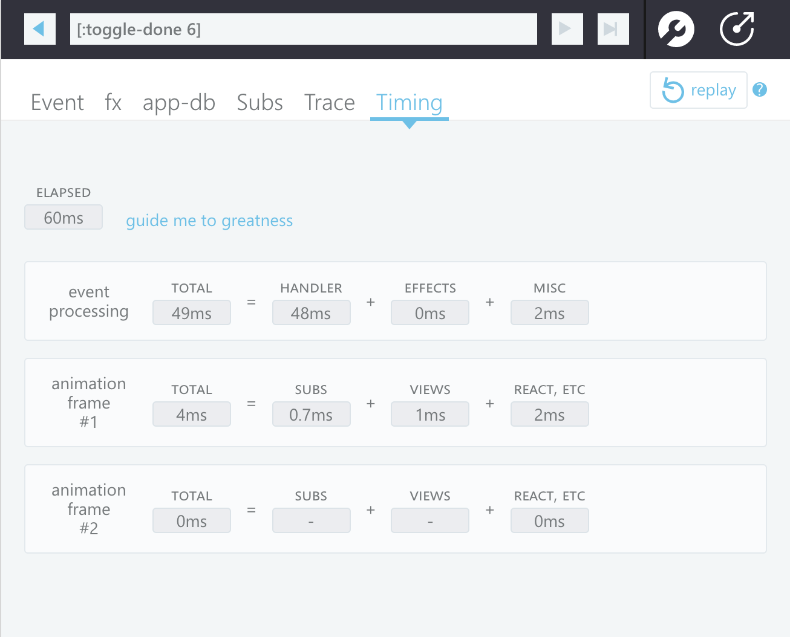
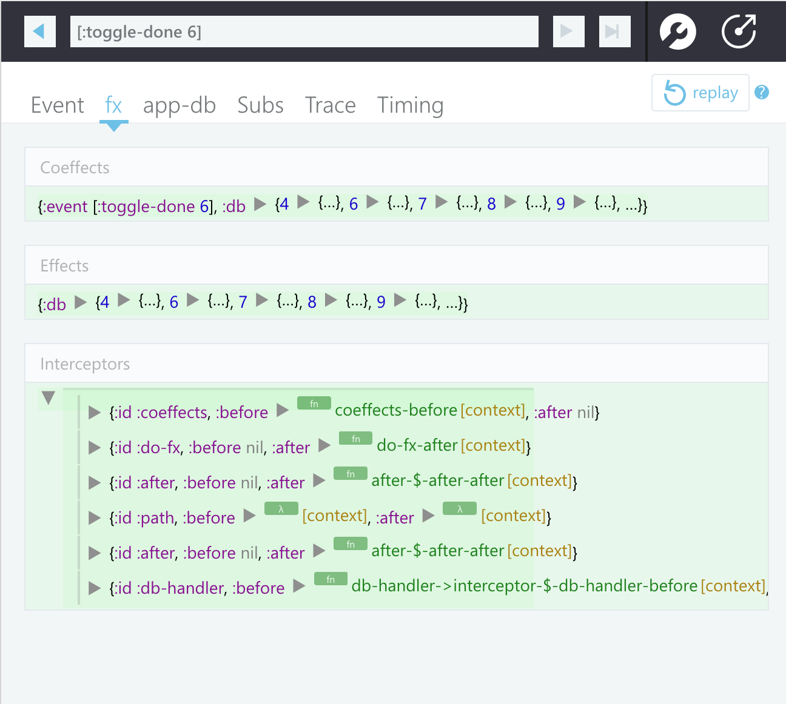
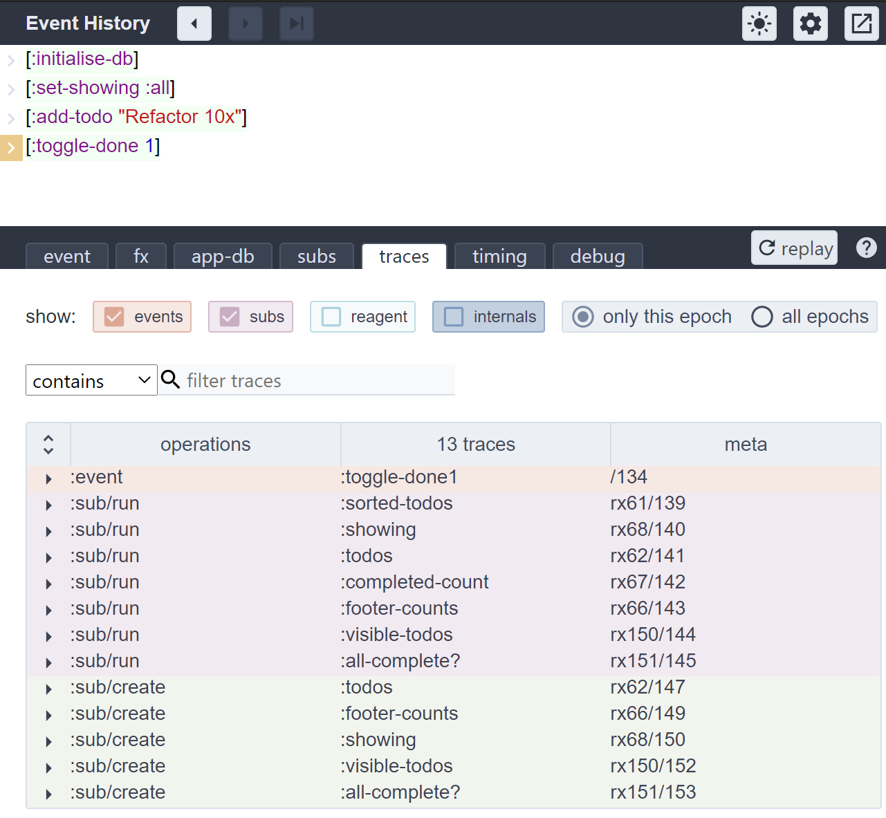

[](https://clojars.org/day8.re-frame/re-frame-10x)
[](https://github.com/day8/re-frame-10x/issues)
[](https://github.com/day8/re-frame-10x/blob/master/LICENSE)

# re-frame-10x

`re-frame-10x` lets you instrument, and then inspect, the inner workings of a
running `re-frame` application. It presents as a programmer's dashboard, 
delivering curated insight and illumination.

It helps you to find your false assumptions faster.

## Show Me



## Describe It To Me

### It Is Epoch Oriented

`re-frame` applications are computationally regular. First an event happens,
and then boom, boom, boom go a series of known computational steps (aka dominoes),
in a known order. When this chain reaction completes,
a `re-frame` app enters a quiescent state waiting for another
event to kick off the next iteration of the same process.

Each `re-frame` event and its consequent computation forms a bounded "epoch"
which can be inspected, analysed and understood independently of other epochs. This
tool is epoch-oriented - it shows you one at a time.

And, yes, it has "time travel debugger" capabilities - you can go
[backwards and forwards through epochs](https://condenaststore.com/featured/the-conga-line-of-past-selves-a-string-liana-finck.html) - but that's really not the most interesting or powerful aspect of what `re-frame-10x` delivers.

### It Is About Trace Data

As it runs, `re-frame` logs "trace" as data, and this provides an x-ray (MRI?) of your app's inner
functions. At its most basic level, `re-frame-10x` is a consumer, processor and presenter
of trace data.

### It Is About The Data Flow

`re-frame` is a functional framework but it's design is "data oriented". It
"flows" data, in a loop, through the functions you provide.
To understand what is happening in your `re-frame` app, you must understand
what data is "happening".

### It Is Always About The Data

So, that's two good `re-frame`-specific reasons why data is at the core of
`re-frame-10x`, but actually, the importance of data is even more fundamental
that that.

Each time you put a `println` into your program, you are printing out what?
And why? Invariably, it is data which fuels your debugging investigation,
confirming your current hypothesis, or not.

And when you write your unit tests, you represent your expections as what? Code is proved
correct by the data it produces.

So, for debugging and understanding activities, "more data, more easily" is winning. If
`re-frame-10x` does its job, it shouldn't be necessary for you to add `printlns`.
The data you need should be captured and presented, and, if further experimentation
is required, it should be available in your REPL too.

### Data Brings Code To Life

Perhaps you have seen LightTable in action?

In the small, it is a delightfully productive debugging environment because it co-renders
code with the data generated by running the code. The data provides a "paper trail" which
brings the code to life, revealing its dynamics and enriching
a programmer's understanding.

`re-frame-10x` has a similar goal, although the method is different.

### It Is A Data Dashboard

Observing raw data trace is both interesting and valuable, but it isn't enough.
First, we want to leverage this data for insights. And, second, there's often too much data - you
can drown in the detail.

So, `re-frame-10x` tries to be a "dashboard" which curates this
"raw data" into "information" through various kinds of analysis
and "roll ups". It should deliver insight "at a glance", while still allowing
you to drill down into the detail.

## Helps Me How?

Four ways:

  1. It helps you to learn `re-frame`.  Simply looking at
     the "raw traces" provides insight into how it operates. Even experienced
     re-framians, er, like me, have learned a lot.

  2. It helps you to explore and learn an unfamiliar `re-frame` codebase.
     When I click, over here, on this "X" button, it shows me what event is `dispatch`-ed
     and in which namespace the associated event handler is registered.  And,
     "oh look, that's interesting - four subscriptions recalculated". Etc.

  3. It helps you with debugging. You see an x-ray of your app's functioning.
     In particular, it will assist you to write and debug
     event handlers, which is useful because they hold most of the logic
     in your `re-frame` apps.

  4. It helps you to find performance problems and/or detect where there is
     unnecessary computation occurring.

Point 3, is primary, of course. But Point 2 is almost as important because we all spend a
lot of our time groking unfamiliar codebases. Being able to observe the inner
workings of a running app is a great way to bring code to life, reveal key
features, and build a cognitive map of how the code is structured.

### Temporary Warning

> Some of the claims above are aspirational. `re-frame-10x` [remains a WIP](https://github.com/day8/re-frame-10x/issues/118).

## Of Sausage And Sizzle

Internal discussion about a name meandered for a while.  Initially, it was `re-frame-trace`, which is accurate, sure, but it is also 100% sausage because it talks about low level function, and not higher level benefit (sizzle, sizzle).  Side stepping the issue, I wanted to call it `vox-datum` (voice of the data) but that was cruelly rejected, for reasons I don't care to remember. The pain. I mean, who the hell doesn't like a Latin name??  Philistines.

If benefit was a must, then there was `-insight` and `-illumination`, but adding either made the name waaaay too long.  Naming things - it really is a nightmare!

Finally, `-10x` cheekily materialised, delivering 100 decibels of audacious sizzle, and consequently a challenge for us to live up to. A 10x programmer starts by having 10x more knowledge and insight - so go make that tool, smarty pants.


## Installation

re-frame-10x configuration is per-project, only one person in your team needs to configure a project to use it, and then everyone else can benefit.

If you are using leiningen, modify `project.clj` in the following ways. When puzzling over the various possible leiningen configurations, it's often helpful to look at a sample [project.clj](https://github.com/technomancy/leiningen/blob/stable/sample.project.clj).

### IMPORTANT PREREQUISITES

* You **must** have a [`:main`](https://clojurescript.org/reference/compiler-options#main) specified in your `:compiler` config or a `:module` (shadow-cljs) for the `:preloads` and `:closure-defines` to take effect
* You **must** be running with the Closure define `goog.DEBUG` as `true`. This is the default under `:optimizations :none`.
* You **must** be using `:optimizations :none`.
* You **should** be using re-frame 1.2.0 or later. Earlier versions may work, but are not supported.

If you don't meet those pre-requisites, see the docs on [advanced setups](/docs/Advanced-Setup.md) for other ways to install re-frame-10x.

[](https://clojars.org/day8.re-frame/re-frame-10x)

### Easy setup

- Update your re-frame dependency to at least `1.2.0` - `[re-frame "1.2.0"]`.

- Add re-frame-10x as a dev dependency by placing `[day8.re-frame/re-frame-10x "1.0.2"]` within `:dependencies`

  - For shadow-cljs, within `dependencies`. For example:

  ```cljs
  :dependencies
  [[day8.re-frame/tracing      "0.6.2"]
   [day8.re-frame/re-frame-10x "1.0.2"]]
  ```

  - For Leiningen, within `:profiles :dev :dependencies`. For example:

  ```cljs
  :profiles
     {:dev
        {:dependencies [[day8.re-frame/tracing      "0.6.2"] 
                        [day8.re-frame/re-frame-10x "1.0.2"]] }}
  ```


- Locate your compiler config for your development build and add `:closure-defines` and `:preloads` to enable re-frame-10x.

  For example using [shadow-cljs](https://shadow-cljs.github.io/docs/UsersGuide.html) update your `shadow-cljs.edn`:
  
  ```cljs
  :builds
  {:client
   {:target     :browser
    :output-dir "resources/public/js"
    :modules
    {:client
     {:init-fn todomvc.core/main}}
    :devtools
    {:preloads [day8.re-frame-10x.preload]}
    :dev
    {:compiler-options
     {:closure-defines
      {re-frame.trace.trace-enabled?        true
       day8.re-frame.tracing.trace-enabled? true}}}
    :release
    {:build-options
     {:ns-aliases
      {day8.re-frame.tracing day8.re-frame.tracing-stubs}}}}}}
  ```

  For example using [cljsbuild](https://github.com/emezeske/lein-cljsbuild) and Leiningen update your `project.clj`:

  ```cljs
  :profiles 
  {:dev  
    {:cljsbuild
      {:builds
        [{:id           "dev"
          :source-paths ["src" "dev"]
          :compiler     {...
                         :closure-defines      {"re_frame.trace.trace_enabled_QMARK_" true}
                         :preloads             [day8.re-frame-10x.preload]
                         :main                 "myapp.core" ;; You must specify a :main or follow the advanced setup ^^^
                         }}]}}}
  ```
  
  If you're using [figwheel-main](https://github.com/bhauman/figwheel-main), update your `dev.cljs.edn` file:
  
  ```cljs
  ^{:watch-dirs   ["src/main/cljs"]
    :ring-handler "...}
  {:main            "myapp.core" ;; You must specify a :main or follow the advanced setup ^^^
   :closure-defines {"re_frame.trace.trace_enabled_QMARK_" true}
   :preloads        [day8.re-frame-10x.preload]}
  ```

  The key things you need to add are:
  
  - `:closure-defines      {"re_frame.trace.trace_enabled_QMARK_" true}`
  - `:preloads             [day8.re-frame-10x.preload]`


[cljs-devtools](https://github.com/binaryage/cljs-devtools) is not required to use re-frame-10x, but it is highly recommended.

### Compatibility Matrix

Reagent Versions  | React Versions      | re-frame-10x Artifact | Status |
----------------- | ------------------- | --------------------- | ------ | 
`1.0.x`           | `17.x`              | [](https://clojars.org/day8.re-frame/re-frame-10x) | [](https://github.com/day8/re-frame-10x/actions?workflow=ci) |
`0.10.x`          | `16.13.x`           | `[day8.re-frame/re-frame-10x "0.7.0"]` | Frozen |
`0.9.x`           | `16.9.x`            |  `[day8.re-frame/re-frame-10x "0.5.2"]` | Frozen |
`0.8.x`           | `16.x.x` - `16.8.6` | `[day8.re-frame/re-frame-10x "0.4.3"]` | Frozen |
`0.6.x` - `0.7.x` | `15.x`              | `[day8.re-frame/re-frame-10x "0.3.7"]` | Frozen |

**For versions < 0.4.0:** If your project uses React 16 and Reagent 0.8.0-alpha2 (or higher) then you will need to add the qualifier `-react16` to the version, e.g. `[day8.re-frame/re-frame-10x "VERSION-react16"]`.

**Note**: If also using [re-com](https://github.com/day8/re-com) then on upgrading reagent you may also need to upgrade re-com.

### Code Tracing

re-frame-10x includes an experimental code tracing feature for tracing the code in your event handlers. See [day8/re-frame-debux](https://github.com/day8/re-frame-debux) for instructions on how to set it up.

## Usage

- **Make sure you have followed all of the installation instructions above.**

- Start up your application.

- Once it is loaded, focus the document window and press `ctrl-h` to slide open the trace panel and enable tracing.

- When the panel is closed, tracing is disabled.

## Use Cases

### app-db



* Inspect a portion of app-db's state with the path inspector, allowing you to focus on just the parts you care about.
* Reset app-db to before an event was run to run it again, instead of resetting the whole application
* Toggle app-db before and after states for running an event, to inspect UI changes.

### Subs


* See the output and diff of a subscription running
* Spot [layer 2 subscriptions](docs/HyperlinkedInformation/UnchangedLayer2.md) that should really be layer 3's.
* Spot subscriptions that are running when they shouldn't
* Spot subscriptions that are being destroyed and recreated unnecessarily

### Timing



* Answer the question "Why is my app slow when it runs this event?"
* See whether time is spent in processing an event, running the subscriptions, or rendering the changes

### Event



* See the coeffects given to an event handler
* See the effects produced by an event handler
* See the interceptors involved in handling an event.

### Trace



* Dig into the low level execution details of an epoch. We've tried to surface the useful information in the other panels, so if you're constantly referring to this panel, open an issue with your use case.

## Troubleshooting

* Try a `lein clean`
* Make sure you have followed all the installation steps.
* Make sure you have checked the [prerequisites](#important-prerequisites)

### If the re-frame-10x window won't show up when pressing Ctrl-H

* Make sure that your browser window doesn't have focus in a text-box or something else that is intercepting keyboard events.
* Make sure that the re-frame-10x div has been created. Run `document.querySelector('#--re-frame-10x--')` in your browser's console to check if an element is returned. If this returns `null` then something else isn't working correctly.

### If re-frame-10x throws an exception on startup

* Reset the settings to factory defaults in the settings panel
* If you can't load the settings panel, run `day8.re_frame_10x.trace.factory_reset_BANG_()` in the JavaScript console.
* If neither of those work, remove all of the keys with the prefix `day8.re-frame.trace` from your browser's Local Storage.

### Some parts of re-frame-10x seem to work but others don't

* Make sure you are using the minimum recommended re-frame version in the [prerequisistes](#important-prerequisites). Some parts of re-frame-10x rely on updated versions of re-frame to capture the information it needs.

### The expansion triangles in the data browsers don't work any more. But they used to.

* (While running your app), in Chrome, go to `devtools` (F12), choose the `Application` Tab and then select (on the left) `Local Storage` and clear out what's there. Restart your app.  Fixed?   (Warning this removes your `re-frame-10x` settings)
* If the problem persists, the nuclear option is to open a new Chrome tab and browse to `chrome://settings/resetProfileSettings`. Multiple people have confirmed this works, but it's a bit too destructive.
* Tell us (in the Clojurians #re-frame slack channel) what you did immediately before the problem showed up. We're still trying to track down the reasons.

## How does it work?

re-frame is instrumented - all important activity generates trace data.

`re-frame-10x` consumes this trace data and renders useful visualisations of the `re-frame` process. Currently, re-frame's tracing capabilities are in alpha and are subject to change at any time. We're testing the utility of the the trace by building an app on top.

By default, re-frame tracing is "compiled out", so it won't impose a performance cost in production. The trade-off here is that you need to explicitly enable it in development.

The [preloads](https://github.com/clojure/clojurescript/wiki/Compiler-Options#preloads) option (`:preloads [day8.re-frame-10x.preload]`) has to be set in order to automatically monkeypatch Reagent to add appropriate lifecycle hooks. Yes this is gross, and yes we will [make a PR to reagent to add proper hooks](https://github.com/day8/re-frame-10x/issues/115), once we know exactly what we need. The preload namespace also injects a div containing the devtools panel into the DOM.

## Developing/Contributing

If you want to work on re-frame-10x, see [DEVELOPERS.md](DEVELOPERS.md).

## Citations

* [open](https://thenounproject.com/search/?q=popout&i=334227) by Bluetip Design from the Noun Project
* [reload](https://thenounproject.com/adnen.kadri/collection/arrows/?i=798299) by Adnen Kadri from the Noun Project
* [Camera](https://thenounproject.com/search/?q=snapshot&i=200965) by Christian Shannon from the Noun Project
* [Delete](https://thenounproject.com/term/delete/926276) by logan from the Noun Project
* [Settings](https://thenounproject.com/search/?q=settings&i=1169241) by arjuazka from the Noun Project
* [Wrench](https://thenounproject.com/icon/1013218/) by Aleksandr Vector from the Noun Project
* [pause](https://thenounproject.com/icon/1376662/) by Bhuvan from the Noun Project
* [play]() by Bhuvan from the Noun Project
* [Log Out](https://thenounproject.com/icon/54484/) by Arthur Shlain from the Noun Project
* [Arrow Up](https://thenounproject.com/search/?q=up%20arrow&i=1921080#) by Alice Design from the Noun Project
* [Arrow Down](https://thenounproject.com/term/down/1920957/#) by Alice Design from the Noun Project
* [Arrow Left](https://thenounproject.com/term/arrow/1920815/#) by Alice Design from the Noun Project
* [Arrow Right](https://thenounproject.com/term/right/1920795/#) by Alice Design from the Noun Project
